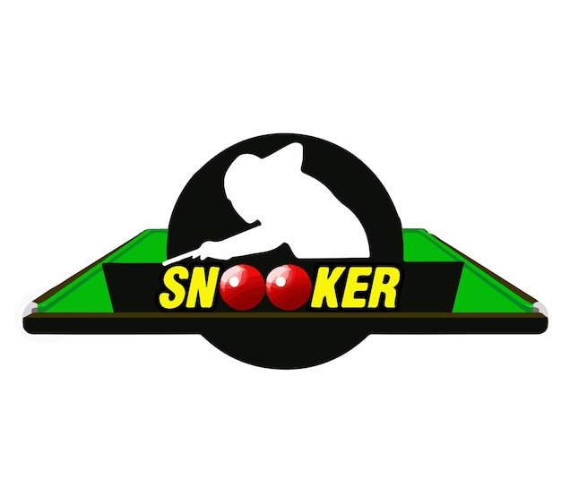

# 🎱 SnookerPlay - Tournament Management System

<div align="center">
  
  <br>
  <em>Professional snooker tournament management platform</em>
</div>

## 📋 Project Description

SnookerPlay is a comprehensive full-stack web application designed to revolutionize how snooker tournaments are organized, managed, and experienced. The platform serves as a central hub connecting players, clubs, and tournament organizers in the snooker community.

### What SnookerPlay Does:

- **For Tournament Organizers:** Simplifies the entire tournament management process, from creation and scheduling to participant registration and bracket generation. Organizers can focus on running great events instead of administrative tasks.

- **For Players:** Provides an intuitive platform to discover upcoming tournaments, register with ease, make secure payments, and track their performance and tournament history through a personalized dashboard.

- **For Clubs and Venues:** Offers visibility to host venues, helping them attract more events and players, while streamlining the scheduling and organization process.

The system handles the complex logistics of tournament management, including automatic fixture generation, email notifications, payment processing through Stripe, and real-time updates for all participants. With responsive design principles, SnookerPlay delivers a seamless experience across desktop and mobile devices, making tournament management accessible anywhere.

## ✨ Features

- 🏆 **Tournament Management** - Create, organize, and manage tournaments with customizable formats
- 👥 **User Authentication** - Secure login and registration with Clerk
- 💳 **Payment Processing** - Integrated payment system with Stripe
- 📧 **Email Notifications** - Automated updates for registrations and tournament information
- 🎯 **Tournament Registration** - Easy registration process for players
- 📊 **Fixture Generation** - Automatic bracket creation and management
- 📱 **Responsive Design** - Optimized user experience across all devices
- 📈 **Player Dashboard** - Track tournament participation and history

## 🛠️ Tech Stack

### Frontend

- **React 19** with Vite for fast development
- **React Router v7** for navigation
- **Clerk** for authentication
- **Stripe Elements** for payment processing
- **TailwindCSS** for styling
- **Framer Motion** for animations
- **React Toastify** for notifications
- **Axios** for API requests
- **Lucide React** for icons

### Backend

- **Node.js** with Express
- **MongoDB** with Mongoose for database
- **Clerk SDK** for secure authentication
- **Stripe API** for payment processing
- **Nodemailer/SendGrid/Resend** for email services
- **CORS** for cross-origin resource sharing

## 🚀 Getting Started

### Prerequisites

- Node.js (v18 or higher)
- npm or yarn
- MongoDB database
- Clerk account for authentication
- Stripe account for payments
- Email service account (SendGrid/Nodemailer)

### Environment Setup

#### Backend (.env)

```
MONGO_URI=your_mongodb_connection_string
CLIENT_URL=http://localhost:5173
PORT=5000
CLERK_SECRET_KEY=your_clerk_secret_key
STRIPE_SECRET_KEY=your_stripe_secret_key
STRIPE_WEBHOOK_SECRET=your_stripe_webhook_secret
EMAIL_FROM=your_email@example.com
SENDGRID_API_KEY=your_sendgrid_api_key
```

#### Frontend (.env)

```
VITE_CLERK_PUBLISHABLE_KEY=your_clerk_publishable_key
VITE_API_URL=http://localhost:5000/api
VITE_STRIPE_PUBLISHABLE_KEY=your_stripe_publishable_key
```

### Installation

1. **Clone the repository**

   ```bash
   git clone https://github.com/JaiminR7/SnookerPlay.git
   cd SnookerPlay
   ```

2. **Install dependencies**

   ```bash
   # Backend setup
   cd server
   npm install

   # Frontend setup
   cd ../client
   npm install
   ```

3. **Start development servers**

   ```bash
   # Start the backend server
   cd ../server
   npm run dev

   # In a new terminal, start the frontend
   cd ../client
   npm run dev
   ```

4. **Access the application**
   - Frontend: http://localhost:5173
   - Backend API: http://localhost:5000

## 📊 API Endpoints

### Tournaments

- `GET /api/tournaments` - Get all tournaments
- `POST /api/tournaments` - Create new tournament
- `GET /api/tournaments/:id` - Get tournament by ID
- `GET /api/v1/tournaments` - Get tournaments (v1 API)

### Registration

- `POST /api/registration` - Register for a tournament

### Payments

- `POST /api/webhooks/stripe` - Handle Stripe webhook events

### Testing

- `GET /api/tournaments/test-email` - Test email service
- `GET /api/tournaments/send-all-users` - Send test emails to all users

## 📁 Project Structure

```
SnookerPlay/
├── client/                # Frontend React application
│   ├── public/            # Static files and images
│   └── src/
│       ├── components/    # Reusable UI components
│       ├── pages/         # Page components
│       ├── config/        # Configuration files
│       └── assets/        # Images and other resources
│
└── server/                # Backend Node.js application
    ├── config/            # Server configuration
    ├── models/            # MongoDB schemas
    ├── routes/            # API endpoints
    ├── services/          # Business logic
    └── utils/             # Helper functions
```

## 🤝 Contributing

1. Fork the repository
2. Create your feature branch: `git checkout -b feature/amazing-feature`
3. Commit your changes: `git commit -m 'Add some amazing feature'`
4. Push to the branch: `git push origin feature/amazing-feature`
5. Open a Pull Request

## 📄 License

This project is licensed under the ISC License.

## 👨‍💻 Developer

Project maintained by [JaiminR7](https://github.com/JaiminR7)
